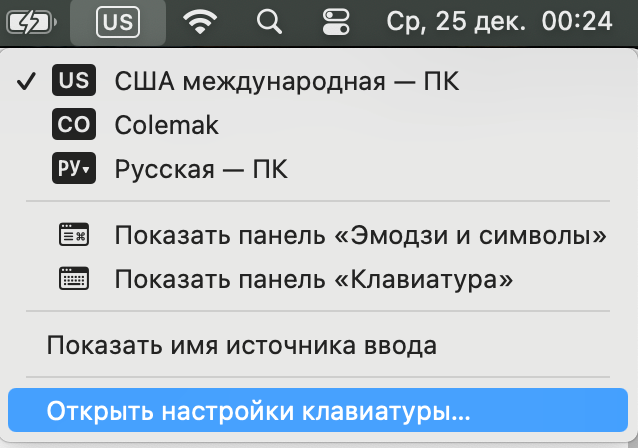
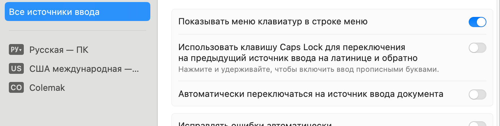
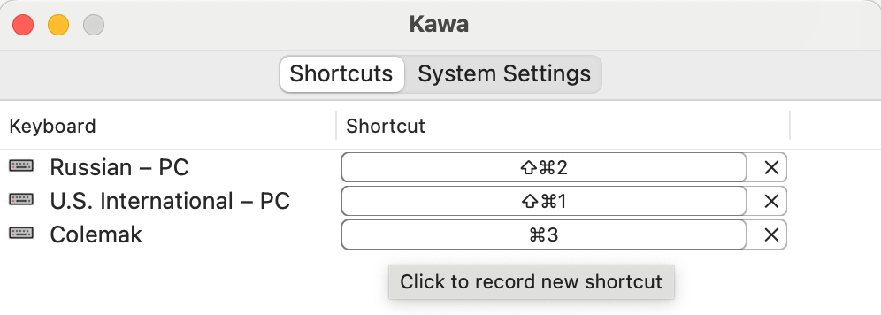
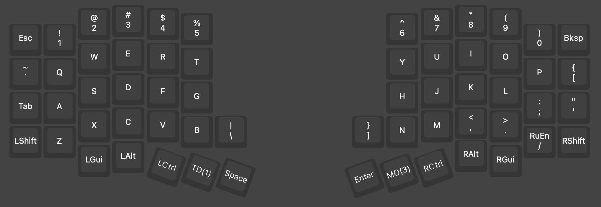
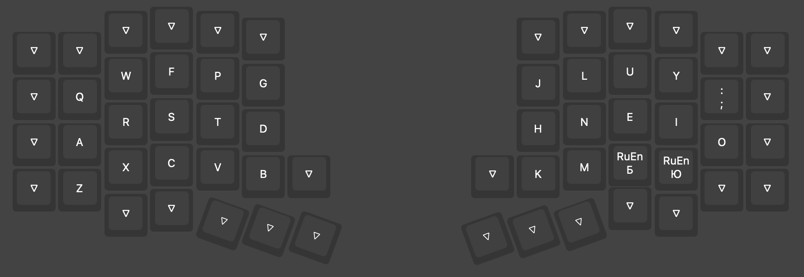
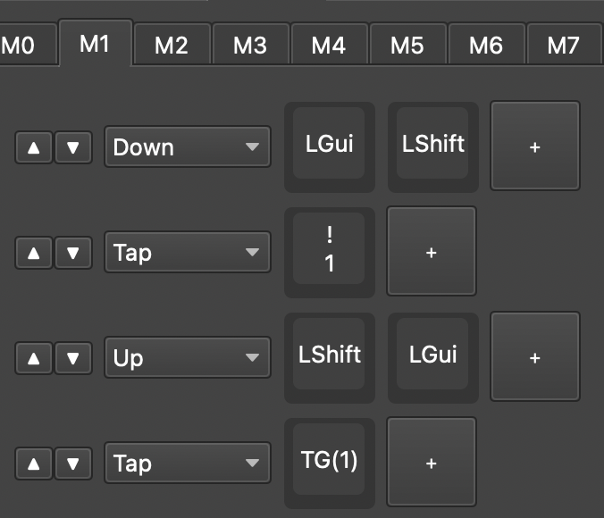
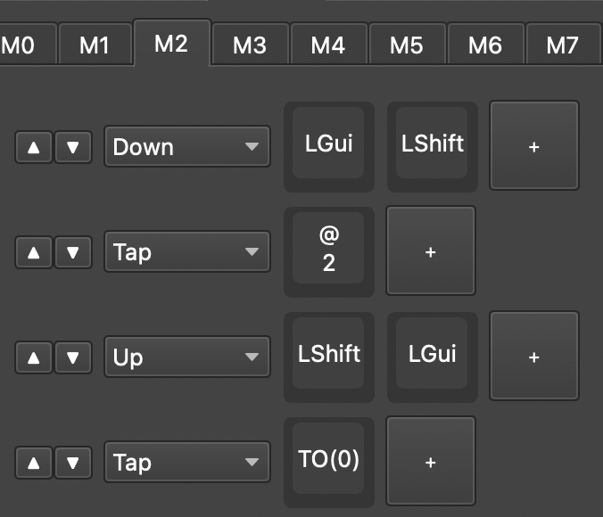
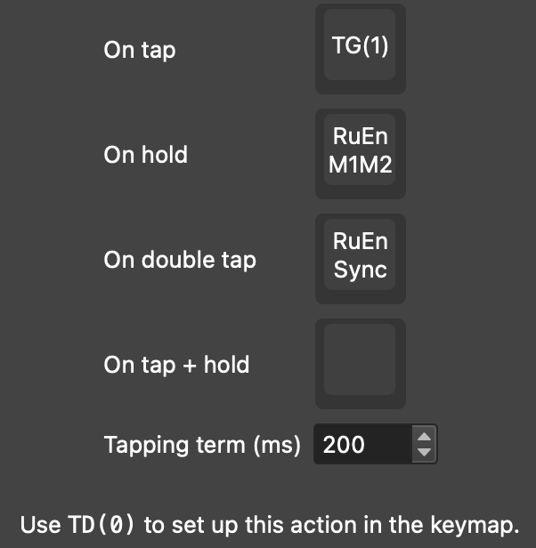

Разносим Ru и En раскладки на разные слои
=========================================
Получилось у меня настроить на MacOS RuEn M1M2 с Colemak раскладкой на отдельном слое. Хочу теперь этим поделиться.

Зачем?
------
Можно не перенастраивать клавиатуру, а просто добавить в систему нужную раскладку.
В целом, этого может хватить. Но если вы ищете приключений, или кажутся нетерпимыми такие проблемы:
- В vial не понятно, какие клавиши где. Например, надо помнить, что двоеточие - это "P", или точка/запятая - это "W" и "E" как в dvorak.
- RuEn работает неправильно. Вместо ":" печатает "O"
- CAPSWORD не работает, и печатается как CAPSWord (ведь "о" - это ";")

Тo можно попрробовать вынести раскладку в клавиатуру.

Что нужно сделать для настройки
--------------------------------
1. Проверяем, что в системе есть нужные раскладки - стандартные QWERTY и ЙЦУКЕН. 

   Дополнительно добавляем/оставляем и нужную кастомную раскладку в системе.
   Переключаться из нашей клавиатуры туда не будем. Эта раскладка будет про запас, для встроенной клавиатуры ноутбука.
   
2. Проверяем, что не выставлена галочка "Автоматически переключаться на источник ввода документа". И что в системе нет еще какого-то софта, поддерживающего разные языки у разных окон (у меня это был полу-отключенный PuntoSwitcher).
   

   
   
   

3. Ставим kawa: https://github.com/hatashiro/kawa
   > brew install --cask kawa
   
4. Настраиваем шорткаты, какие хотим:
   

5. Делаем два слоя "0" и "1". Остальные слои сдвигаем "вправо" на один.
   
   На нулевом у нас раскладка для кириллицы:
    

   На первом - замена буквенных клавиш на вашу раскладку:
   

6. Прописываем макросы смены языка в M1 и M2 (оба будут помимо переключения языка включать/выключать слой с латиницей):
   

    
   
   

   Это дает нам возможность переключаться и клавишами "RuEn En"/"RuEn Ru" и "RuEn Toggle" на ваш вкус.

   Переход на кириллицу (TO(0)) выключает все слои кроме нулевого (с обычным положением клавиш), переход на латиницу - подключает слой c кастомным положением клавиш. (TG(1))

   Сначала я и там и там использовал TG(1), но постоянно натыкался на рассинхрон слоёв и языка.

7. Ну и как же без всяких разных кнопок синхронизаций? 
   У нас тут может сбиться:
   - RuEnM1M2 режим (от перепрошивки)
   - Разъехаться язык с системой (чинится не только по RuEn Sync, но и просто переключением)
   - Слой #1 может разойтись с языком. 
   
   Я собрал это в один tap-dance:

   

8. Пользуемся настроенной клавиатурой. 

Пара слов о qmk-hid-host
------------------------

P.S. qmk-hid-host тут необязателен. За счет раздельных шорткатов на языки синхронизация RuEn не теряется. А синхронизировать слой он все равно не помогает. В итоге, qmk-hid-host разве что для часов на экране остается полезен.
